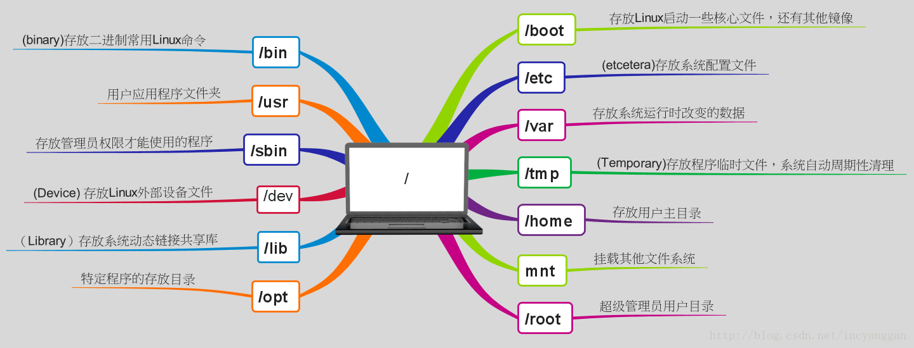

Linux文件系统结构
==========

| 目录            |       说明                                                |
|-----------------|-----------------------------------------------------------|
| **/**           |    /目录也称为根目录，位于linux文件系统目录结构的顶层。在很多系统中的唯一分区。如果还有其他分区，必须挂在到/目录下某个位置。整个目录结构呈树型结构，因此也称为目录树。|
| **/bin**        |    bin目录为命令文件目录，也称为二进制目录。包含了供系统管理员及普通用户使用的重要的linux命令和二进制（可执行）文件，包含shell解释器等，该目录不能包含子目录。 |
| **/boot**       |    boot目录，该目录中存放系统的内核文件和引导装载程序文件。例如：RHEL5的内核文件：vmlinuz-2.6.18-8.el5xen。 |
| **/dev**        |    dev目录，也称设备（device）文件目录，存放连接到计算机上的设备（终端、磁盘驱动器、光驱及网卡等）的对应文件，包括字符设备和块设备等。 |
| **/etc**        |    etc目录存放系统的大部分配置文件和子目录。X Window系统的文件保存在/etc/X11子目录中，与网络有关的配置文件保存在/etc/sysconfig子目录中。该目录下的文件由系统管理员来使用，普通用户对大部分文件有只读权限。 |
| **/home**       |    home目录中包含系统上各个用户的主目录，子目录名称即为各用户名。 |
| **/lib**        |    lib目录下存放了各种编程语言库。典型的linux系统包含了C、C++和FORTRAN语言的库文件。用好这些语言开发的应用程序可以是使用这些库文件。这就使软件开发者能够利用那些预先写好并测试过的函数。/lib目录下的库映像文件可以用来启动系统并执行一些命令。目录/lib/modules包含了可加载的内核模块。/lib目录存放了所有重要的库文件，其他的库文件爱你则大部分存放在/usr/lib目录下。|
| **/lost+found** |    lost+found目录，在EXT2或EXT3文件系统中，当系统意外崩溃或机器意外关机，产生的一些文件碎片放在这里。在系统启动的过程中fsck工具会检查这里，并修复已经损坏的文件系统。有时系统发生问题，有很多的文件被移到这个目录中，可能会用手工的方法来修复，或者移动文件到运来的位置上。 |
| **/opt**        |    opt目录表示的是可选择的意思，有些软件包也会被安装在这里，某些第三方应用程序通常安装在这个目录。|
| **/root**       |    root目录为系统管理员的主目录。 |
| **/usr**        |    usr目录是linnux系统中最大的系统之一，很多系统中，该目录是最为独立分区挂载的。该目录中主要存放不经常变化的数据，以及系统下安装的应用程序目录。 |
| **/mnt**        |    mnt目录主要用来临时挂载文件系统，为某些设备提供默认挂载点，如floppy，cdrom。这样当挂载了一个设备如光驱时，就可以通过访问目录/mnt/cdrom下的文件来访问相应的光驱上的文件了。 |
| **/proc**       |    proc目录是一个虚拟的文件系统，该目录中的文件是内存中过的映像。可以通过查看该目录中的文件过去有关系统硬件运行的详细信息，例如使用more或者less命令查看/proc/interrupts文件以获取硬件中断（IRQ）信息，查看/proc/cpuinfo文件以获取CPU的型号、主频等信息。| 
| **/sbin**       |    sbin目录下保存系统管理员或者root用户的命令文件。/usr/sbin存放了应用软件，/usr/local/sbin存放了通用的根用户权限的命令。| 
| **/tmp**        |    tmp目录存放了临时文件，一些命令和应用程序会用的到这个目录。该目录下的所有文件会被定时删除，以避免临时文件占满整个磁盘。 |
| **/var**        |    var目录以及该目录下的子目录中通常保存经常变化的内容，如系统日志、邮件文件等。|
